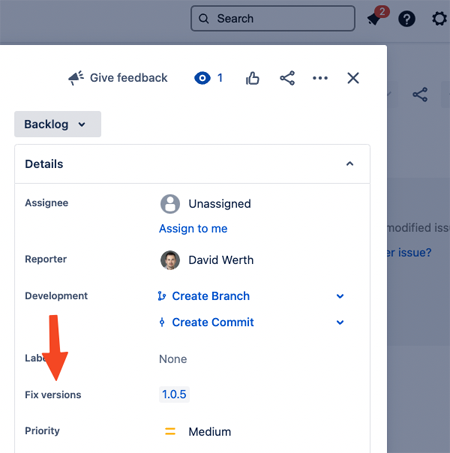

# Jira create and set fix version

This action is intended for Continuous Delivery with Jira Cloud.
The action will set the "fix version" in Jira to the given version (and creates the version if needed).



## Inputs
- `domain`: Domain name of the Jira cloud instance (e.g. your-domain.atlassian.net)
- `username`: Jira Username
- `password`: Jira Personal Access Token. Get it from [here](https://id.atlassian.com/manage-profile/security/api-tokens)
- `versionName`: The name of the Version to use (e.g. "1.0.5")
- `issueKeys`: The key(s) of the issue(s) that is to be updated. If multiple are used, separate them with a comma (e.g. "TEST-1,TEST-2")
- `versionDescription`: The description of the Version (default: "CD version")
- `versionArchived`: Mark the new version as archived (default: true)

## Outputs
None


## Example usage
```yaml
uses: levigo/github-action-jira-fixversion@v1.0
with:
  domain: "my-company.atlassian.net"
  username: "technical-user@company.net"
  password: "fmpUJkGhdKFvoTJclsZ03xw1"
  versionName: "1.0.5"
  versionDescription: "Continuous Delivery Version"
  issueKeys: "TEST-1"
```

### Usage with "GLIX Action – the Git Log Identifier eXtractor"

Here is an example on how to extract the `issueKeys` from the commit messages and set the same fix version
for all those Jira issues.

```yaml
  - uses: actions/checkout@v3
    with:
      fetch-depth: '30'

  - uses: levigo/github-action-glix@v1.0
    id: glix
    with:
      commitId: ${{ github.sha }}
      mainBranch: "master"

  - uses: levigo/github-action-jira-fixversion@v1.0
    with:
      domain: "my-company.atlassian.net"
      username: "technical-user@company.net"
      password: "fmpUJkGhdKFvoTJclsZ03xw1"
      versionName: "1.0.5"
      versionDescription: "Continuous Delivery Version"
      issueKeys: ${{ steps.glix.outputs.issueKeys }}
```


### Usage with "Action Regex Match"

Here is an example on how to extract the `issueKeys` (but only the latest) from the commit message.
The regex is based on [Atlassian Documentation](https://confluence.atlassian.com/stashkb/integrating-with-custom-jira-issue-key-313460921.html).

```yaml
      - uses: actions-ecosystem/action-regex-match@v2
        id: regex-match
        with:
          text: ${{ github.event.head_commit.message }}
          regex: "((?<!([A-Z]{1,10})-?)[A-Z]+-\d+)"

      - uses: levigo/github-action-jira-fixversion@v1.0
        with:
          domain: "my-company.atlassian.net"
          username: "technical-user@company.net"
          password: "fmpUJkGhdKFvoTJclsZ03xw1"
          versionName: "1.0.5"
          versionDescription: "Continuous Delivery Version"
          issueKeys: ${{ steps.regex-match.outputs.match }}
```
